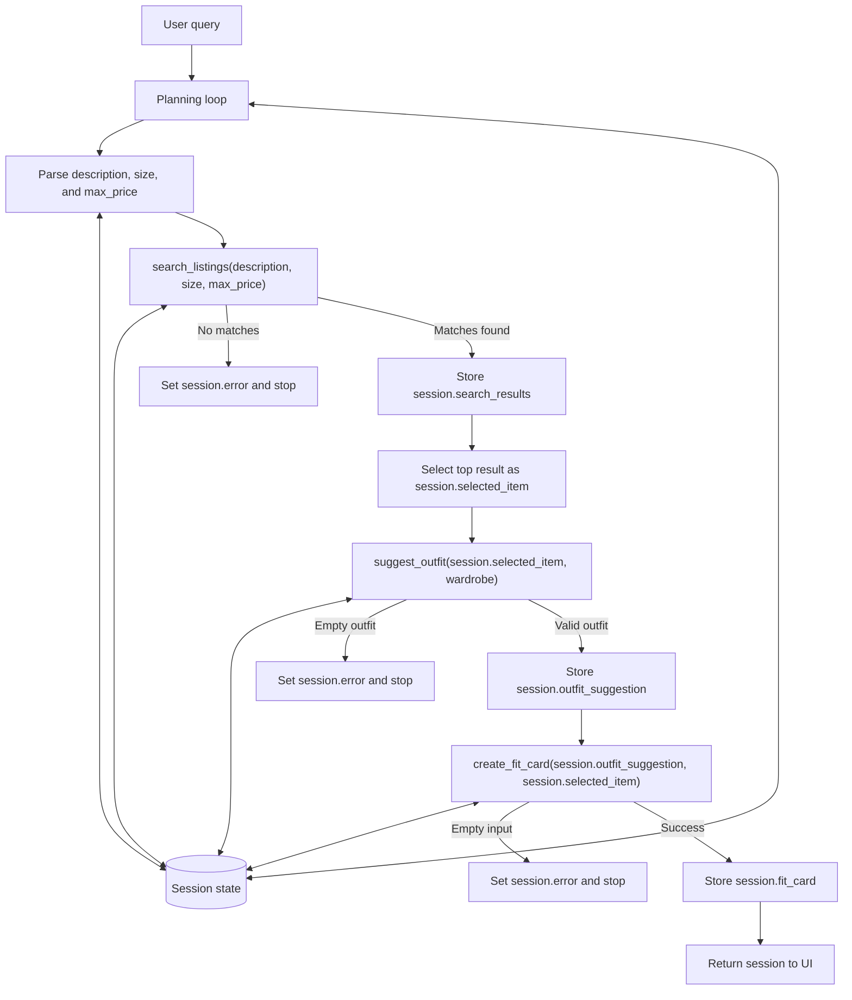

# FitFindr

FitFindr is a multi-tool AI agent that helps users discover secondhand clothing items and understand how they can be styled with an existing wardrobe. The agent searches a mock thrift listings dataset, generates outfit recommendations using the user's wardrobe, and creates a shareable social-media-style fit card.

The project demonstrates multi-tool orchestration, state management, error handling, and agent planning using a structured planning loop.

---

## Architecture Overview



---

## What's Included

```
ai201-project2-fitfindr-starter/
├── data/
│   ├── listings.json          # 40 mock secondhand listings
│   └── wardrobe_schema.json   # Wardrobe format + example wardrobe
├── utils/
│   └── data_loader.py         # Helper functions for loading the data
├── planning.md                # Your planning template — fill this out first
└── requirements.txt           # Python dependencies
```

## Setup

```bash
pip install -r requirements.txt
```

Set your Groq API key in a `.env` file (get a free key at [console.groq.com](https://console.groq.com)):
```
GROQ_API_KEY=your_key_here
```

## The Mock Listings Dataset

`data/listings.json` contains 40 mock secondhand listings across categories (tops, bottoms, outerwear, shoes, accessories) and styles (vintage, y2k, grunge, cottagecore, streetwear, and more).

Each listing has: `id`, `title`, `description`, `category`, `style_tags`, `size`, `condition`, `price`, `colors`, `brand`, and `platform`.

Load it with:
```python
from utils.data_loader import load_listings
listings = load_listings()
```

## The Wardrobe Schema

`data/wardrobe_schema.json` defines the format your agent uses to represent a user's existing wardrobe. It includes:

- `schema`: field definitions for a wardrobe item
- `example_wardrobe`: a sample wardrobe with 10 items you can use for testing
- `empty_wardrobe`: a starting template for a new user

Load an example wardrobe with:
```python
from utils.data_loader import get_example_wardrobe
wardrobe = get_example_wardrobe()
```

## Where to Start

1. **Read `planning.md` and fill it out before writing any code.**
2. Verify the data loads correctly by running `python utils/data_loader.py`.
3. Build and test each tool individually before connecting them through your planning loop.

Your implementation files go in this same directory. There's no required file structure for your agent code — organize it however makes sense for your design.
