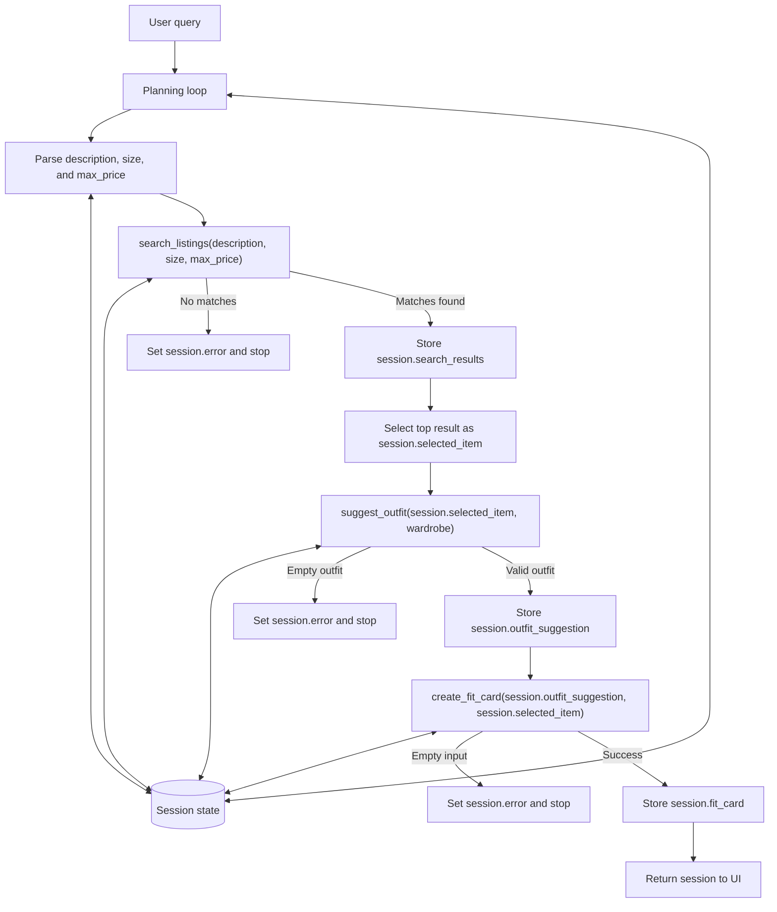

# FitFindr

FitFindr is a multi-tool AI agent that helps users discover secondhand clothing items and understand how they can be styled with an existing wardrobe. The agent searches a mock thrift listings dataset, generates outfit recommendations using the user's wardrobe, and creates a shareable social-media-style fit card.

The project demonstrates multi-tool orchestration, state management, error handling, and agent planning using a structured planning loop.

---

## Architecture Overview



---

## Tool Inventory

### 1. search_listings(description, size, max_price)

**Purpose:**
Retrieves and ranks secondhand clothing listings from the marketplace dataset based on the user's search criteria, budget, and size preferences.

**Inputs:**

* `description (str)` – keywords describing the item the user wants to find
* `size (str | None)` – optional size filter
* `max_price (float | None)` – optional maximum budget

**Output:**

* `list[dict]` – matching listings sorted by relevance score. Each listing contains fields such as `id`, `title`, `description`, `category`, `style_tags`, `size`, `condition`, `price`, `colors`, `brand`, and `platform`.

---

### 2. suggest_outfit(new_item, wardrobe)

**Purpose:**
Uses an LLM to generate personalized outfit recommendations by combining a selected thrifted item with pieces already present in the user's wardrobe.

**Inputs:**

* `new_item (dict)` – the selected listing returned by `search_listings()`
* `wardrobe (dict)` – the user's wardrobe in the format defined by `wardrobe_schema.json`

**Output:**

* `str` – one or more outfit recommendations. When wardrobe items are available, the response references specific pieces by name. If the wardrobe is empty, the tool returns general styling advice for the selected item.

---

### 3. create_fit_card(outfit, new_item)

**Purpose:**
Uses an LLM to transform an outfit recommendation into a concise social-media-style caption suitable for sharing a completed look.

**Inputs:**

* `outfit (str)` – the outfit recommendation returned by `suggest_outfit()`
* `new_item (dict)` – the selected listing returned by `search_listings()`

**Output:**

* `str` – a 2–4 sentence Instagram/TikTok-style fit card that highlights the thrifted item, reflects the outfit vibe, and naturally incorporates the item name, price, and platform.

---

## Planning Loop

FitFindr follows a **conditional planning loop** rather than calling every tool in a fixed sequence.

1. The agent receives a user query and extracts the values needed for `search_listings()`, including the description, size, and budget.
2. The agent calls `search_listings()` and stores the returned listings in session state.
3. If no listings are found, the agent stores an error message, returns early, and does not call any additional tools.
4. If listings are found, the agent selects the top-ranked result and stores it as `selected_item`.
5. The agent calls `suggest_outfit()` using the selected item and the user's wardrobe.
6. If a valid outfit recommendation is returned, it is stored in session state as `outfit_suggestion`.
7. The agent calls `create_fit_card()` using the outfit recommendation and selected item.
8. The generated fit card is stored in session state and returned to the user.

This workflow allows the agent to change its behavior based on tool outputs. For example, when `search_listings()` returns no results, the workflow stops immediately instead of continuing to later tools with invalid input.

---

## State Management

FitFindr uses a **session dictionary** as the source of truth for a single user interaction. The session stores the original query, parsed search parameters, search results, selected listing, wardrobe information, outfit recommendation, fit card, and any error messages generated during execution.

State is updated as the workflow progresses:

* `session["parsed"]` stores the extracted description, size, and budget values used for searching.
* `session["search_results"]` stores the full list of listings returned by `search_listings()`.
* `session["selected_item"]` stores the top-ranked listing chosen from the search results.
* `session["outfit_suggestion"]` stores the recommendation returned by `suggest_outfit()`.
* `session["fit_card"]` stores the final caption returned by `create_fit_card()`.
* `session["error"]` stores an error message when the workflow cannot continue.

This approach allows information returned by one tool to be passed directly into the next tool without requiring the user to re-enter data. For example, the same `selected_item` produced by `search_listings()` is passed into both `suggest_outfit()` and `create_fit_card()`, while the outfit recommendation generated by `suggest_outfit()` becomes the input to `create_fit_card()`.

---

## Error Handling

Each tool includes explicit error handling so the agent can recover gracefully instead of crashing or continuing with invalid data.

### search_listings()

**Failure mode:** No listings match the user's query.

**Agent behavior:**
`search_listings()` returns an empty list instead of raising an exception. The planning loop detects the empty result, stores an error message in `session["error"]`, and stops before calling any additional tools.

**Example tested:**
I deliberately searched for:

```text
designer ballgown size XXS under $5
```

The tool returned:

```python
[]
```

and the UI displayed:

> No matching listings were found. Try broadening the size filter or increasing your budget.

The workflow stopped before calling `suggest_outfit()` or `create_fit_card()`.

---

### suggest_outfit()

**Failure mode:** The user has an empty wardrobe.

**Agent behavior:**
Instead of failing, the tool generates general styling advice based on the selected item. This allows the workflow to continue and still produce a fit card.

**Example tested:**
I selected **Empty wardrobe (new user)** and searched for:

```text
vintage graphic tee under $50
```

The tool returned general styling advice describing clothing types, shoes, accessories, and outfit vibes without referencing any owned wardrobe items.

The workflow continued successfully and generated a fit card based on the styling recommendation.

---

### create_fit_card()

**Failure mode:** The outfit recommendation is empty or missing.

**Agent behavior:**
The tool returns a descriptive error message string instead of raising an exception.

**Example tested:**

Input:

```python
create_fit_card("", item)
```

Output:

```text
Unable to create a fit card because no outfit suggestion was generated.
```

This prevents the application from crashing and clearly explains what went wrong.

---

## Setup and Running the Project

### Install dependencies

```bash
pip install -r requirements.txt
```

### Configure Groq

Create a `.env` file in the project root:

```env
GROQ_API_KEY=your_key_here
```

### Run the application

```bash
python app.py
```

Open the URL displayed in the terminal (typically `http://localhost:7860`) and submit a query through the Gradio interface.

### Example Queries

FitFindr supports two wardrobe modes:

* **Example wardrobe** – uses a predefined wardrobe containing tops, bottoms, shoes, outerwear, and accessories.
* **Empty wardrobe (new user)** – simulates a new user who has not added any wardrobe items yet.

#### Example wardrobe

* `vintage graphic tee under $30`
* `90s track jacket in size M`
* `flowy midi skirt under $40`
* `black combat boots size 8`

#### Empty wardrobe (new user)

* `vintage graphic tee under $50`
* `y2k baby tee under $25`

#### Failure-mode test

* `designer ballgown size XXS under $5`

---

## Spec Reflection

### How the Spec Helped

The planning process made implementation significantly easier by forcing the tool interfaces, planning loop, state management, and error handling behavior to be defined before writing code. Because the expected inputs, outputs, and failure modes were documented in advance, each tool could be implemented and tested independently before being connected through the agent.

### One Way Implementation Diverged from the Spec

The planning loop originally described extracting a description, size, and budget from the user query. During implementation, the description field was simplified by using the raw query string directly as the search description while still extracting size and budget separately using regular expressions. This reduced complexity, avoided an unnecessary LLM call for parsing, and worked well with the keyword-overlap ranking used by `search_listings()`.

---

## AI Usage

### Instance 1

* **What I gave the AI:**

  I used Claude Code to implement the three required tools: `search_listings()`, `suggest_outfit()`, and `create_fit_card()`. For each tool, I first completed the corresponding specification in `planning.md`, including the tool purpose, inputs, outputs, failure modes, and error-handling behavior. I then provided Claude Code with the relevant tool specification from `planning.md`, the corresponding section of `tools.py`, and the helper functions available in `utils/data_loader.py`.

* **What it produced:**

  Claude Code generated implementation plans and then produced the tool implementations. This included keyword-based listing retrieval and ranking for `search_listings()`, LLM-powered outfit generation for `suggest_outfit()`, and social-media-style fit card generation for `create_fit_card()`. Claude also generated the pytest test suite used to validate the tools and their failure modes.

* **What I changed or overrode:**

  I reviewed each implementation plan before allowing any code changes. Rather than generating the entire agent at once, I implemented and validated the project incrementally. I first completed and tested `search_listings()`, then moved to `suggest_outfit()`, followed by `create_fit_card()`, and only after all three tools worked independently did I implement the planning loop. For each step, I reviewed the generated code, verified the behavior against the specification in `planning.md`, tested both normal and failure scenarios, and confirmed I understood the implementation before proceeding to the next milestone.

  For `suggest_outfit()`, I requested revisions to the prompt design so that the tool used all important listing and wardrobe fields, handled empty wardrobes more explicitly, and included a dedicated fashion stylist system prompt. For `create_fit_card()`, I revised the prompt design to use a social-media-caption-writing role rather than a generic text-generation role and ensured that the generated captions behaved like Instagram/TikTok outfit posts rather than product descriptions.

### Instance 2

* **What I gave the AI:**

  I used Claude Code to implement the planning loop in `agent.py`. I provided the Planning Loop, State Management, and Architecture sections from `planning.md`, along with the existing `agent.py` structure and session dictionary design. I also used ChatGPT throughout the project to review design decisions, evaluate planning-loop behavior, and validate state-management choices

* **What it produced:**

  Claude Code generated an implementation plan and then implemented `run_agent()` using the documented workflow. It also implemented the UI integration in `handle_query()` by connecting the Gradio interface to the planning loop and mapping the session state to the output panels. ChatGPT provided feedback on the planning loop, state management approach, prompt design, and error handling strategy.

* **What I changed or overrode:**

  I reviewed the generated planning-loop design before implementation and verified that it matched the documented specification. I chose to use a deterministic parsing approach with regular expressions instead of introducing an additional LLM call to extract query parameters. I also verified that the agent stopped early when `search_listings()` returned no results and that state flowed correctly between tools through the session dictionary before integrating the workflow into the Gradio interface.
