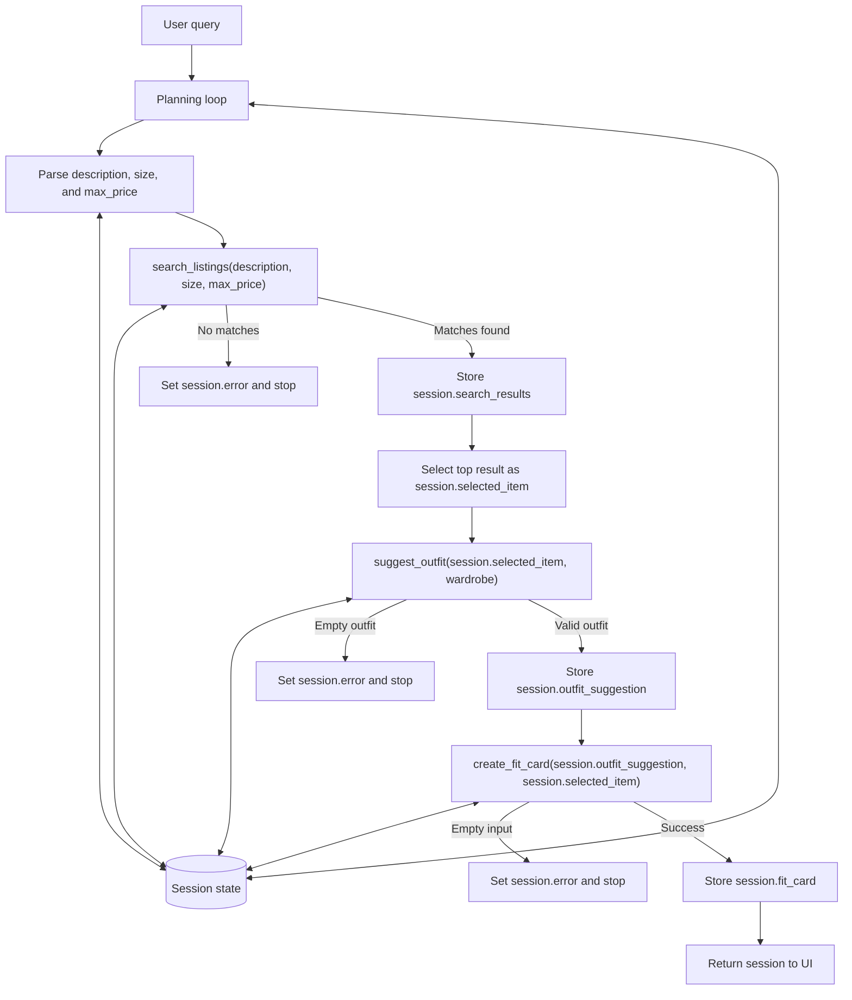

# FitFindr — planning.md

> Complete this document before writing any implementation code.
> Your spec and agent diagram are what you'll use to direct AI tools (Claude, Copilot, etc.) to generate your implementation — the more specific they are, the more useful the generated code will be.
> Your planning.md will be reviewed as part of your submission.
> Update it before starting any stretch features.

---

## Tools

### Tool 1: search_listings

**What it does:**

Searches the listings dataset for secondhand clothing items that match the user's description, size, and budget. It filters and ranks listings based on relevance, then returns the matching items for the agent to evaluate.

**Input parameters:**

- `description` (str): Keywords or item description provided by the user (e.g., "vintage graphic tee").
- `size` (str): Desired clothing size to match against listing sizes. Can be None if the user does not specify a size.
- `max_price` (float): Maximum amount the user is willing to spend.

**What it returns:**

Returns a list[dict] of matching listings sorted by relevance. Each listing dictionary contains fields from the dataset including `id`, `title`, `description`, `category`, `style_tags`, `size`, `condition`, `price`, `colors`, `brand`, and `platform`.

**What happens if it fails or returns nothing:**

Returns an empty list []. The agent informs the user that no matching listings were found, suggests adjusting the search criteria (such as increasing the budget or changing the size filter), and stops without calling the remaining tools.

---

### Tool 2: suggest_outfit

**What it does:**

Generates an outfit recommendation using the selected listing and the user's existing wardrobe. It suggests how to combine the new item with clothing and accessories already owned by the user to create a complete look.

**Input parameters:**

- `new_item` (dict): The selected listing returned by search_listings(). Contains fields such as `title`, `category`, `style_tags`, `colors`, `size`, and `price`.
- `wardrobe` (dict): The user's wardrobe in the format defined by `wardrobe_schema.json`, containing an items list of wardrobe pieces.

**What it returns:**

Returns a `str` containing one or more outfit suggestions. The suggestion references specific wardrobe items when available and explains how the new item can be styled as a complete outfit.

**What happens if it fails or returns nothing:**

If the wardrobe is empty or contains too few items to build a complete outfit, the tool returns a general styling recommendation based on the selected item instead of failing. The agent continues to the next step using this fallback suggestion.

---

### Tool 3: create_fit_card

**What it does:**

Creates a short, shareable social media style caption based on the outfit suggestion and selected item. The fit card summarizes the look in a fun and engaging way that a user could post alongside an outfit photo.

**Input parameters:**

* `outfit` (str): The outfit recommendation generated by `suggest_outfit()`.
* `new_item` (dict): The selected listing returned by `search_listings()`, including details such as the item title, price, brand, style tags, and platform.

**What it returns:**

Returns a `str` containing a short fit card or caption that highlights the selected item and outfit styling. The generated text should vary based on the provided outfit and item details.

**What happens if it fails or returns nothing:**

If the outfit input is empty or incomplete, the tool returns a descriptive error message explaining that a fit card could not be generated because no outfit recommendation was available. The agent displays this message to the user instead of crashing.

---

### Additional Tools (if any)

None currently planned. The initial implementation will focus on the three required tools. A price comparison tool may be added later as a stretch feature after the core agent workflow is complete.

---

## Planning Loop

**How does your agent decide which tool to call next?**

1. Read the user query and determine the description, size, and maximum budget values needed for `search_listings()`.
2. Call `search_listings(description, size, max_price)`.
3. If `search_listings()` returns an empty list:
   - Store an error message in `session["error"]`.
   - Tell the user that no matching listings were found and suggest adjusting the search criteria.
   - Stop the workflow without calling any additional tools.
4. If listings are found:
   - Select the first result as the best match.
   - Store it in `session["selected_item"]`.
5. Call `suggest_outfit(session["selected_item"], wardrobe)`.
6. If `suggest_outfit()` returns an empty string or cannot generate a usable outfit suggestion:
   - Store an error message in `session["error"]`.
   - Stop the workflow without calling `create_fit_card()`.
7. If a valid outfit suggestion is returned:
   - Store it in `session["outfit_suggestion"]`.
8. Call `create_fit_card(session["outfit_suggestion"], session["selected_item"])`.
9. Store the generated caption in `session["fit_card"]`.
10. Return the completed session to the user interface.

---

## State Management

**How does information from one tool get passed to the next?**

The agent uses a single session dictionary as the source of truth for one user interaction. The session is created at the start of `run_agent()` and stores the original query, the parsed search inputs, the raw search results, the selected listing, the user's wardrobe, the outfit suggestion, the final fit card, and any error message. This lets each tool receive the output of the previous step without the user repeating information.

The session fields are updated in order as the workflow runs. First, `session["parsed"]` stores the extracted `description`, `size`, and `max_price`. Next, `session["search_results"]` stores the list returned by `search_listings()`, and `session["selected_item"]` stores the top-ranked listing chosen from that list. Then `session["outfit_suggestion"]` stores the string returned by `suggest_outfit()`, and `session["fit_card"]` stores the final caption returned by `create_fit_card()`. If any step fails, `session["error"]` is set and the agent returns early, which prevents later tools from running with missing input.

---

## Error Handling

For each tool, the agent handles failure in a specific way so the workflow does not crash or continue with missing data.

| Tool | Failure mode | Agent response |
|------|-------------|----------------|
| `search_listings` | No listings match the user query | Set `session["error"]` to a clear message such as "No matching listings were found for that search. Try broadening the size filter or increasing your budget." Stop the workflow immediately and do not call `suggest_outfit()` or `create_fit_card()`. |
| `suggest_outfit` | The wardrobe is empty or too limited to build a full outfit | Return a fallback styling suggestion based on the selected item instead of crashing. If the tool still cannot produce a usable suggestion, set `session["error"]` and stop before calling `create_fit_card()`. |
| `create_fit_card` | The outfit input is empty or missing | Return a descriptive error string such as "Unable to create a fit card because no outfit suggestion was generated." The agent shows this message to the user instead of crashing. |

---

## Architecture



---

## AI Tool Plan

### Milestone 3 — Individual tool implementations

**AI Tool:** Claude Code (Plan Mode)

**Input provided to Claude:**
- The corresponding tool specification from the **Tools** section of this document
- The **Error Handling** section for that tool
- `tools.py`
- `utils/data_loader.py`

**Expected output:**
- An implementation of the requested tool in `tools.py`
- Logic that matches the documented inputs, outputs, and failure behavior
- Use of the provided data loader functions instead of reimplementing data access

**Verification process:**
- Confirm that the function signature matches the specification
- Confirm that the return value matches the documented format
- Confirm that the failure mode behaves as described in the Error Handling section
- Run pytest tests and manually test the function with both valid and invalid inputs before moving to the next tool

### Milestone 4 — Planning loop and state management

**AI Tool:** Claude Code (Plan Mode)

**Input provided to Claude:**
- The **Planning Loop** section
- The **State Management** section
- The **Architecture** diagram
- `agent.py`

**Expected output:**
- An implementation of `run_agent()` that follows the documented workflow
- Correct use of the session dictionary for passing data between tools
- Early termination when a required tool fails or returns no usable result

**Verification process:**
- Confirm that the implementation follows the documented step order
- Confirm that `search_listings()` is not followed by `suggest_outfit()` when no results are found
- Confirm that `session["selected_item"]` is passed into `suggest_outfit()`
- Confirm that `session["outfit_suggestion"]` is passed into `create_fit_card()`
- Run the happy-path and failure-path examples provided in `agent.py`
- Compare the final behavior against the Architecture diagram and Planning Loop specification before accepting the implementation

---

## A Complete Interaction (Step by Step)

FitFindr helps users discover secondhand clothing items that match their style, size, and budget, then shows how those items can be incorporated into their existing wardrobe. When a user submits a clothing request, the agent first calls `search_listings()` to find matching listings, passes the selected item to `suggest_outfit()` to generate a styling recommendation, and then sends that recommendation to `create_fit_card()` to produce a short, shareable outfit caption. If a tool cannot complete its task, such as when no listings are found, the agent provides a clear explanation and actionable next steps instead of continuing with incomplete data.

**Example user query:** "I'm looking for a vintage graphic tee under $30. I mostly wear baggy jeans and chunky sneakers. What's out there and how would I style it?"

**Step 1:**

The agent extracts the search criteria from the user query and calls:

`search_listings(description="vintage graphic tee", size=None, max_price=30.0)`

The tool searches the listings dataset and returns a list of matching listing dictionaries sorted by relevance. The agent reviews the returned results and selects the first result as the best match for the next step. Each listing contains the fields:

`id`, `title`, `description`, `category`, `style_tags`, `size`, `condition`, `price`, `colors`, `brand`, and `platform`.

Example top result:

- Graphic Tee — 2003 Tour Bootleg Style
- Price: $24
- Size: L
- Style tags: graphic tee, vintage, grunge, streetwear, band tee
- Platform: Depop

The agent stores the returned list in `session["search_results"]` and selects the first result as `session["selected_item"]`.

**Step 2:**

The agent calls:

`suggest_outfit(session["selected_item"], wardrobe)`

using `session["selected_item"]` and the user's wardrobe.

The tool returns an outfit recommendation such as:

```text
"Pair the graphic tee with your baggy straight-leg jeans and chunky white sneakers for a relaxed vintage streetwear look. Layer the vintage black denim jacket on top and finish with the black crossbody bag."
```

The agent stores this result in `session["outfit_suggestion"]`.

**Step 3:**

The agent calls:

`create_fit_card(session["outfit_suggestion"], session["selected_item"])`

using the outfit recommendation generated in Step 2 and the selected listing from Step 1.

The tool returns a shareable fit card such as:

```text
"Found this vintage-style graphic tee for $24 and it fits perfectly with my baggy denim rotation ✨ paired it with chunky sneakers and a black denim jacket for an easy everyday thrifted look."
```

The agent stores this result in `session["fit_card"]`.

**Final output to user:**

**Selected item:**

* Graphic Tee — 2003 Tour Bootleg Style ($24, Depop)

**Outfit suggestion:**

* Pair the graphic tee with baggy straight-leg jeans, chunky white sneakers, a vintage black denim jacket, and a black crossbody bag.

**Fit card:**

* "Found this vintage-style graphic tee for $24 and it fits perfectly with my baggy denim rotation ✨ paired it with chunky sneakers and a black denim jacket for an easy everyday thrifted look."
